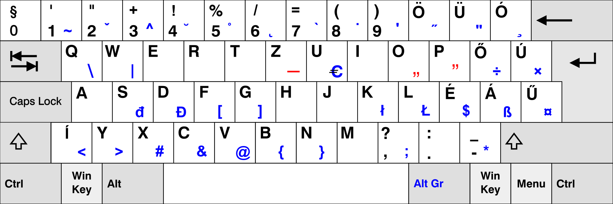
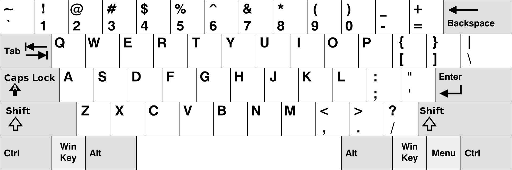

## Billentyűzet

A billentyűzet is elengedhetetlen része a számítógépeknek. Az idők kezdetén
amikor még csak zsenik és az ufók értettek a számítástechnikához, na akkor is,
billentyűzetet használtak! Lássuk mit tudunk a p5.js segítségével elérni.

### Globális változók (Global variables)

Az egér kezeléshez hasonlóan a billentyűzethez is elérhetőek előre definiált globális
változók.
 - **keyIsPressed** - Egy tetszőleges billentyű le van e nyomva vagy sem.
 - **key** - A legutolsó alkalommal lenyomott billentyű.
 - **keyCode** - A legutolsó alkalommal lenyomott billentyű kódja.

Próbáljuk ki az alábbi programocskát. Nyomkodjuk a billentyűket és figyeljük mit
látunk a kimeneten.
- Mit látunk ha egy sima karaktert nyomunk le? Pl.: a
- Mit látunk ha egy nagy betűt gépelünk be? Pl.: F
- Mi lesz ha a nyíl billentyűket vagy épp a space-t nyomjuk le?

Hasonlóan meg tudjuk egy kicsit talán még szemléletesebben tekinteni a *key* és *keyCode*
különbségeket az alábbi oldalon: [Keycode](http://keycode.info/).

```JavaScript
function setup() {
  createCanvas(400, 400);
}

function draw() {
  background(220);
  if(keyIsPressed){
    print("key: " + key + " keyCode: " + keyCode);
  }
}
```

A *key*-ben mindig megjelenik az aktuális billentyű a megszokott szöveges formában
Pl.: a, b, C, D.

A *keyCode* pedig egy szám kódot ír ki minden billentyűre, például a fenti billentyűkhöz:
65, 66, 67, 68.

Érdekes módon ha lenyomjuk a Shift-et és közben írunk valamit akkor látjuk, igen ahogy megszoktuk
nagy betűt látunk a *key*-ben, de a *keyCode* ugyan az maradt! Miért van ez?

#### Billentyűzet és a kiosztásai

Talán először futottunk bele a hardware és a szoftver közötti különbségekbe és ezt jól
szimbolizálja a fenti példa. Lényegében a billentyűzet nem más mint gombok egy halmaza amiket
több fajta méretben tudunk elérni mint pl.: 105, 104, 86, 61 vagy 44 gombbal. Ezeknek a gomboknak
van egy fizikai helye magán a billentyűzeten, amit le tudunk kódolni valamilyen számmá. Így
amikor fizikailag lenyomunk egy billentyűt a gép abból valójában nem lát mást csak ezt a kódot. Ez a pontos
kód rengeteg mindentől függ, de számunkra csak az a lényeges, hogy ezek a kódok a hardware-től
függenek.
A *key* viszont egy kicsit több ennél. A *key* már egy a gép általi értelmezése ennek a *keyCode*-nak.
Ezt az értelmezést befolyásolja  mondjuk hogy lenyomtuk e a Shift-et. A beállított nyelv is befolyásolja mi lesz
a pontos értelmezése. Sőt még azt is megváltoztatja mi lesz a *keyCode*! Ez pedig azért lesz, mert
az operációs rendszerünk (Windows, Mac, Linux) tudja milyen fizikai kiosztással szokott rendelkezni
például egy magyar és egy angol billentyűzet.

Magyar:



Angol:



Nézzük egy az alábbi példán hogy alakulnak a *key* és *keyCode*-ok a nyelvi beállítástól
függően:

Magyar (HU) |-| Angol (ENG) |-  
 ------------ | ------ | ---------- | -------
 *key* | *keyCode* | *key* | *keyCode*
 q|81|q|81
 a|65|a|65
 í|220|\\|220
 ,|188|,|188
 -|173|/|191
 ö|192|0|48

A fenti példában pontosan ugyan azokat a fizikai billentyűket nyomtam le mind a két
nyelvi beállításnál. Valahol ott volna ugyan az a fizikai gomb mint a két nyelvnél
valahol nem. Ettől függően vagy ugyanaz a *keyCode* vagy nem.

Ezzel a hétköznapokban nem kell foglalkoznunk. Ezt a gép mind elfedi eldőlünk.
Viszont érdemes észben tartanunk ha valamilyen problémába ütközünk ami nem tűnik
lehetségesnek.

### Események (Events)
 - **keyPressed()** - Egy billentyű le lett nyomva.
 - **keyReleased()** - Egy billentyű fel lett engedve.
 - **keyTyped()** - Egy billentyű le lett nyomva amelyik nem: Backspace, Delete,
 Ctrl, Shift, vagy az Alt.

Nézzük meg mi történik ha lenyomjuk, lenyomva tartjuk az: a, Shift vagy a felfele
nyíl gombokat.

```JavaScript
function setup() {
  createCanvas(400, 400);
}

function draw() {
  background(220);
  if(keyIsPressed){
    print("key: " + key + " keyCode: " + keyCode);
  }
}

function keyPressed(){
  print("Pressed: " + key)
}

function keyReleased(){
  print("Released: " + key)
}

function keyTyped(){
  print("Typed: " + key)
}
```

A *draw*-ban lévő *print* folyamatosan írja ki a gombokat ha lenyomva tartjuk őket, ráadásul
annyiszor írja ki ahányszor új kép rajzolódik.
Ezzel szemben a **keyPressed()**, **keyReleased()**, **keyTyped()** csak akkor írja ki, egyszer, az adott
billentyűt ha megtörtént hozzá az adott esemény. A referencia szerint ez nem garantált
viselkedés. Így nem számíthatunk rá minden esetben csak egyszer hívódik meg a fenti
három függvény valamelyike.

 ### Függvények (Functions)
 - **keyIsDown()** - Egy megadott billentyű le van e nyomva.

Főleg akkor lesz hasznos ha azt szeretnénk tudni, hogy egyszere több billentyű le
lett e nyomva vagy sem.
Az alábbi példa csak akkor fogja kiírni a szöveget ha az "a" és 'd' billentyűket
egyszerre le vannak nyomva.

```JavaScript
function setup() {
  createCanvas(400, 400);
}

function draw() {
  background(220);
  if(keyIsDown(65) && keyIsDown(68)){
    print("key: " + key + " keyCode: " + keyCode);
  }
}
```

Megfigyelhetjük, hogy ugyan azt nézzük le van e nyomva két billentyű egyszerre a
kiírásnál sokszor azt látjuk mintha csak egy karakter lenne lenyomva.
Ez a globális változók miatt van. A *key* és a *keyCode* értékét tekintve csak annyit
garantál a p5.js, hogy azok egy adott **keyPressed()**, **keyReleased()**, **keyTyped()**
hívás elött frissülnek. Viszont milyen sorrendben, vagy a *draw* függvény elött vagy
után már nincs.

#### ASCII és speciális billentyűk
Ha a p5.js referenciáját nézzük, többször is összefuthatunk a "special key" és "ASCII characters"
megnevezésekkel.

A speciális billentyűk *keyCode*-jai:
- BACKSPACE
- DELETE
- ENTER
- RETURN
- TAP
- ESCAPE
- SHIFT
- CONTROL
- OPTION
- ALT
- UP_ARROW
- DOWN_ARROW
- LEFT_ARROW
- RIGHT_ARROW

A referencia azt javasolja ezeket a *keyCode*-okat érdemes figyelnünk ha a hozzájuk tartozó
billentyű lenyomását figyeljük. Egyébként ha ASCII billentyűket figyelünk akkor a
*key* változó fogja az elvárt karaktert tartalmazni így olyankor érdemes azt követnünk.

Az [ASCII](http://www.asciitable.com/) karaktereket még réges-régen találták ki és
128-an vannak. A miért pont 128-an, nem fontos. Ami fontos, hogy ugyan a p5.js referencia
[ASCII](http://www.asciitable.com/) karaktereknek hívja őket nem ezekre gondol.
Mint látjuk ezeknek más a kódjuk és jelen vannak olyan karakterek is amikről az előbb
még azt mondtuk speciálisak. Sőt olyanok
is, amelyeket amúgy kézzel nem is tudunk begépelni, mint pl.: NUL, SOH, STX. Továbbá
ezeket ha be tudnánk írni se látnánk őket, mert nem megjeleníthetőek. :)
A p5.js referencia ASCII karakterek alatt a sima szövegesen megjeleníthető hétköznapi
karaktereket érti. Ilyen az abc összes betűje, számok, + - * / és minden egyéb jel
amit a fenti speciális karaktereken kívül lenyomva, lényegében ugyan azt látjuk a képernyőn
mint ami a fizikai billentyűre rá van nyomtatva pl.: #, &, @.

[Egér kezelés](4_mouse.md)
