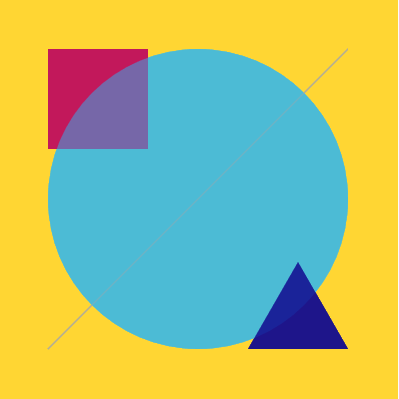

## 2D Rajzolás

A Processing egyik fő erőssége a kényelmes rajzolás. Míg szinte minden más programozási
nyelvben meg kéne küzdenünk a rajzoló környezet felállításával, itt nem kell ilyennel
bajlódnunk. Nem kell belemennünk a **shader**-ek világába és nem kell átbújnunk mindenfajta
**API**-okat amik meghatároznák hogyan lehet az adott könyvtárral programozni.

**API** - Application programming interface, egy kódbázis használati felülete. Például
a p5.js API-ja minden amit a [Reference](https://p5js.org/reference/)-ben leírva találunk.
Ez a felület amit nekünk programozók számára elérhetővé tettek p5.js tervezői.

**Shader** -  Shadernek hívunk egy olyan funkciót ami meghatározott körülmények között
leírja, milyen "színűnek" kell lennie egy adott pixelnek. Egy **shader** nemcsak a dolgok
színét határozhatja meg, de legegyszerűbb így elképzelni őket.

### createCanvas

[Ez](https://p5js.org/reference/#/p5/createCanvas) lesz a függvény amit mindig pontosan egyszer
meg kell hívnunk a programunk elején, mielőtt bármit is ki szeretnénk rajzolni a képernyőre.

```JavaScript
createCanvas(width, height, [renderer])
```

*Szögletes zárójelek függvény paramétereknél* - Opcionális paramétereket szokás
megadni szögletes zárójelek között. Ezeknek ilyen esetekben általában van egy alapértelmezett
értéke.

- **width** - A vásznunk szélessége pixelekben.
- **height** - A vásznunk magassága pixelekben.
- **renderer** - P2D vagy WEBGL. P2D az alapértelmezett és minden két dimenziós rajzolást
tesz elérhetővé. Minden 3D-s alakzathoz a WEBGL renderelő engine-t kell használjuk.

### Beállítások

Két fontos alap konfigurációja van a rajzolásnak. Az egyik maga a szín, a másik meg a megjelenítés mikéntje.

#### Szín

A **colorMode()** függvény meghatározza hogyan kell a p5.js-nek értelmeznie a színeket.
Három fő értelmezés áll rendelkezésünkre:
- RGB
- HSB
- HSL

Mind a három közül az RGB messze a leggyakrabban használt mód, így ez is az alapértelmezett is
a p5.js-ben. A másik kettő teljesen másféleképpen kezeli a színeket és a hétköznapokban nem
lesz rájuk különösebb szükségünk, így ezek felkutatását az olvasóra bízzuk.

Az **RGB** színteret és az általa leírható színeket is gyakran szokás **RGB**-nek hívni.
Elemei:
- **R** - red, piros komponens, értéktartománya: 0 - 255
- **G** - green, zöld komponens, értéktartománya: 0 - 255
- **B** - blue, kék komponens, értéktartománya: 0 - 255

Ahol a *0* jelenti a szín teljes hiányát míg a *255* a maximális intenzitását.
Ezeknek az értékeknek a pontos beállításával kb 16 millió szín előállítására leszünk
képesek. Számos online felületen próbálhatunk ki különböző színeket. Ezek egyike a [Colorcodes](https://htmlcolorcodes.com/color-picker/).

Ez a triumvirátus esetenként ki szokott egészülni még egy **A** értékkel is amit aplha
értéknek hívunk. Ilyenkor egy **RGBA** színről beszélünk. Az **A** csupán annyit határoz meg,
hogy az adott szín mennyire áttetsző.
- **A** - alpha, áttetszőség, értéktartománya: 0 - 255

A 0-ás alpha érték a teljes áttetszőséget jelenti, ilyenkor lényegében nem látjuk tovább
az adott színt, csak ami esetleg mögötte van. A 255 pedig az alapértelmezett érték, ami
a meghatározott színt teljes egészében megtartja.

Szineket lényegében 3 féleképpen tudunk megadni azokon a helyeken ahol az elvárt.
- 1 vagy 2 értékkel

Ilyenkor a szürke 256 árnyalata között állítjuk be az értéket. Ahol *0* a fekete
, míg *255* a fehér lesz. Az opcionális másodlagos paraméter pedig ennek az árnyalatnak
az *alpha* értéke lesz.
```JavaScript
background(56);
```
```JavaScript
background(56, 125);
```
- 3 vagy 4 értékkel

Ebben az esetben megadjuk a szín minden egyes elemét. Az alkalmazott színtértől függ
pontosan mit fog a három paraméter jelenteni. **RGB** esetén a piros, zöld és kék
komponenseket és az opcionális alpha értéket.
```JavaScript
background(153, 153, 0);
```
```JavaScript
background(253, 216, 53, 50);
```

Amennyiben **RGB** színtérrel dolgozunk és mind a piros, zöld és kék komponens intenzitását
ugyan azon az értéken tartjuk, úgy visszakapjuk a szürke árnyalatait. Ilyen esetekben
jóval kényelmesebb az ehhez tartozó specializációt használni.
```JavaScript
background(56, 56, 56);
```

- p5.Color objektummal

A p5.js beépített szín osztálya amelyben bármely színt el tudunk tárolni.
Létrehozásához csupán a **color()** függvényt kell meghívnunk a fentebb leírt
módszerek egyikével.
```JavaScript
let ultramarine_blue = color(18, 10, 143);
```

Példa:
```JavaScript
function setup() {
  createCanvas(400, 400);
}

function draw() {
  stroke(166);
  line(50, 350, 350, 50);
  noStroke();
  background(253, 216, 53, 50);
  let rectangle_color = color(194, 24, 91);
  fill(rectangle_color);
  rect(50, 50, 100, 100);
  let circle_color = color(41, 182, 246, 128);
  fill(circle_color)
  circle(200, 200, 300);
  let triangle_color = color(18, 10, 143, 200);
  fill(triangle_color);
  triangle(250, 350, 300, 263, 350, 350);
}
```



p5.Color
alpha()
blue()
brightness()
color()
green()
hue()
lerpColor()
lightness()
red()
saturation()

#### Megjelenítés

fill()
noFill()
noStroke()
stroke()

clear()
erase()
noErase()

### Alakzatok (Shapes)

### Ívek (Curves)

### Vertexek
