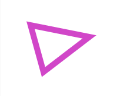
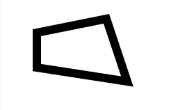

## 2D Rajzolás

A Processing egyik fő erőssége a kényelmes rajzolás. Míg szinte minden más programozási
nyelvben meg kéne küzdenünk a rajzoló környezet felállításával, itt nem kell ilyennel
bajlódnunk.

Az alábbi fejezetben nem megyünk bele a színek pontos részleteibe. Előszóban annyit, hogy
amikor valami színét állítjuk a jelenlegi fejezetben akkor azt mindig három értékkel fogjuk
megtenni. **RGB** azaz piros, zöld és kék megadásával. Erről és a színek egyéb sajátosságairól
bővebben a következő fejezetben.

A szemfülesek kiszúrhatják azt is, hogy nem mindenhol egyeznek meg az itt közölt
paraméterek a referenciában fellelhetőekkel. Ez elsősorban azért van, mert ebben a fejezetben
kizárólag 2D-s rajzolással foglalkozunk és a nem közölt függvények már 3D-s rajzoláshoz
szükségesek.

### createCanvas

[Ez](https://p5js.org/reference/#/p5/createCanvas) lesz a függvény amit mindig pontosan egyszer
meg kell hívnunk a programunk elején, mielőtt bármit is ki szeretnénk rajzolni a képernyőre.

```JavaScript
createCanvas(width, height, [renderer])
```

*Szögletes zárójelek* - Opcionális paramétereket szokás
megadni szögletes zárójelek között. Ezeknek ilyen esetekben általában van egy alapértelmezett
értéke.

- *width* - A vásznunk szélessége pixelekben.
- *height* - A vásznunk magassága pixelekben.
- *renderer* - P2D vagy WEBGL. P2D az alapértelmezett és minden két dimenziós rajzolást
tesz elérhetővé. Minden 3D-s alakzathoz a WEBGL renderelő engine-t kell használjuk.

### Megjelenítés

Minden alakzatnak van egy éle és egy kitöltése. Egy alakzat kitöltési színét a **fill**,
**noFill** függvényekkel tudjuk befolyásolni.
- **fill()** - Beállítja az alakzatok kitöltési színét.
- **noFill()** - Kikapcsolja az alakzatok kitöltését.

Kéken kitöltött kör:
```JavaScript
fill(69, 181, 232);
circle(100, 100, 100);
```


Kitöltés nélküli kör:
```JavaScript
noFill();
circle(100, 100, 100);
```


Az éleket hasonló módon a **stroke**, **noStroke** függvényekkel tudjuk befolyásolni.
- **stroke()** - Beállítja milyen színűek legyenek az élek.
- **noStroke()** - Kikapcsolja az élek megjelenítését.

Sárga élű kék kör:
```JavaScript
fill(69, 181, 232);
stroke(235, 140, 69);
circle(100, 100, 100);
```


Él nélkül:
```JavaScript
fill(69, 181, 232);
noStroke();
circle(100, 100, 100);
```


Az éleket még három paraméterrel tudjuk befolyásolni:
- **strokeWeight()** - Beállítja az élek vastagságát.
- **strokeCap()** - Beállítja milyen módon legyen megjelenítve a vonalak lezáró végei.
- **strokeJoin()** - Meghatározza hogyan jelenjen meg két vonal kereszteződése.

**strokeWeight(weight)**
- *weight* - Az él vastagsága pixelben.

Kék kör 10 pixel szélességű éllel:
```JavaScript
fill(69, 181, 232);
strokeWeight(10);
circle(100, 100, 100);
```


**strokeCap(cap)**
- *cap* - A megjelenítendő vonal vég típus. Ennek három fajtája van:
 *SQUARE*, *PROJECT* és *ROUND*.

Mind a három vonal vég típus fentről lefelé az alábbi sorrendben:*SQUARE*, *PROJECT* ,*ROUND*
```JavaScript
strokeWeight(12.0);
strokeCap(PROJECT);
line(50, 100, 200, 100);
strokeCap(SQUARE);
line(50, 150, 200, 150);
strokeCap(ROUND);
line(50, 200, 200, 200);
```


**strokeJoin(join)**
- *join* - Milyen módon kerüljenek megjelenítésre a vonalak metszési pontjai. Ennek
három fajtája van:
 *MITER*, *BEVEL*, *ROUND*.

Mind a három metszési típus demonstrálva:
```JavaScript
strokeWeight(12.0);
strokeJoin(MITER);
rect(50, 50, 100, 50);
strokeJoin(BEVEL);
rect(200, 50, 100, 50);
strokeJoin(ROUND);
rect(350, 50, 100, 50);
```


### Alakzatok (Shapes)

Számos 2D-s alakzat áll a rendelkezésünkre. Segítségükkel szinte bármit le tudunk majd
rajzolni. Amit pedig nem azokra is ad számos megoldási lehetőséget a p5.js, mint
az ívek és a vertexek használata. Viszont ezekkel majd csak egy másik fejezetben fogunk
megismerkedni. A gyors rajzoláshoz az itt tárgyalt alakzatok bőven elégségesek.
Lássuk hát mi áll a rendelkezésünkre:

- **point()** - Egy pont.
- **line()** - Vonal.
- **triangle()** - Háromszög.
- **square()** - Négyzet.
- **rect()** - Téglalap.
- **quad()** - Négyszög.
- **circle()** - Kör.
- **arc()** - Körív.
- **ellipse()** - Ellipszoid.

#### Point
```JavaScript
point(x, y)
```

Rajzoljunk egy 1 pixel nagyságú pontot. Ennek magában nem sok haszna van.
Viszont a **strokeWeight()** és **stroke()** függvényekkel használva már jóval több
lehetőségünk lesz vele.

```JavaScript
stroke(58, 181, 97);
strokeWeight(30);
point(50, 50);
```


#### Line
```JavaScript
line(x1, y1, x2, y2)
```
Egy vonalat húzunk A pontból B-be.

```JavaScript
stroke(181, 56, 83);
strokeWeight(10);
line(50, 50, 200, 30);
```


#### Triangle
```JavaScript
triangle(x1, y1, x2, y2, x3, y3)
```
Egy tetszőleges háromszöget rajzolunk.

```JavaScript
stroke(209, 70, 200);
strokeWeight(10);
triangle(50, 50, 150, 70, 72, 130);
```



#### Square
```JavaScript
square(x, y, s)
```

Tetszőleges négyzetet rajzol ahol, **x** és **y** a négyzet bal felső sarka, **s** pedig az
oldalhosszúsága.

```JavaScript
stroke(79, 120, 209);
strokeWeight(10);
square(50, 50, 80);
```


#### Rect
```JavaScript
rect(x, y, w, h)
```

Tetszőleges téglalapot rajzol ahol, **x** és **y** a négyzet bal felső sarka, **w** a
szélessége, **h** pedig a magassága.

```JavaScript
fill(150, 155, 17);
rect(50, 50, 100, 60);
```


#### Quad
```JavaScript
quad(x1, y1, x2, y2, x3, y3, x4, y4)
```
- *x1*, *y1* - Első pont.
- *x2*, *y2* - Második pont.
- *x3*, *y3* - Harmadik pont.
- *x4*, *y4* - Negyedik pont.
Tetszőleges négyszöget rajzol ahol mind a négy pont pontos helyzetét meg tudjuk
határozni.

```JavaScript
strokeWeight(12.0);
quad(50, 50, 50, 100, 180, 120, 150, 30);
```



#### Circle
```JavaScript
circle(x, y, d)
```
- *x*, *y* - A kör középpontjának koordinátái.
- *d* - A kör átmérője.

```JavaScript
circle(100, 100, 100);
```


#### Ellipse
```JavaScript
ellipse(x, y, w, [h])
```
- *x*, *y* - A ellipszis középpontjának koordinátái.
- *w* - Az ellipszis szélessége.
- *h* - Az ellipszis magassága.

Egy tetszőleges ellipszist rajzol.
```JavaScript
fill(65, 210, 231);
ellipse(100, 100, 100, 70);
```


#### Arc
```JavaScript
arc(x, y, w, h, start, stop, [mode])
```
- *x*, *y* - A ellipszis középpontjának koordinátái.
- *w* - Az ellipszis szélessége.
- *h* - Az ellipszis magassága.
- *start* - A cikkely kezdetének szögállása radiánban.
- *stop* - A cikkely végének szögállása radiánba.
- *mode* - A cikkely megjelenítésének módja. Három lehetőség van. *CHORD*, *PIE* vagy *OPEN*.

Egy ellipszoid tetszőleges cikkelyének kirajzolására szolgáló függvény.

```JavaScript
fill(99, 205, 158);
arc(100, 100, 100, 70, 0, HALF_PI*3, CHORD);
arc(250, 100, 100, 70, 0, HALF_PI*3, PIE);
arc(400, 100, 100, 70, 0, HALF_PI*3, OPEN);
```


[Billentyűzet](5_keyboard.md) - [Színek](7_colors.md)
