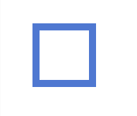

## 2D Rajzolás

A Processing egyik fő erőssége a kényelmes rajzolás. Míg szinte minden más programozási
nyelvben meg kéne küzdenünk a rajzoló környezet felállításával, itt nem kell ilyennel
bajlódnunk. Nem kell belemennünk a **shader**-ek világába és nem kell átbújnunk mindenfajta
**API**-okat amik meghatároznák hogyan lehet az adott könyvtárral programozni.

**API** - Application programming interface, egy kódbázis használati felülete. Például
a p5.js API-ja minden amit a [Reference](https://p5js.org/reference/)-ben leírva találunk.
Ez a felület amit nekünk programozók számára elérhetővé tettek p5.js tervezői.

**Shader** -  Shadernek hívunk egy olyan funkciót ami meghatározott körülmények között
leírja, milyen "színűnek" kell lennie egy adott pixelnek. Egy **shader** nemcsak a dolgok
színét határozhatja meg, de legegyszerűbb így elképzelni őket.

### createCanvas

[Ez](https://p5js.org/reference/#/p5/createCanvas) lesz a függvény amit mindig pontosan egyszer
meg kell hívnunk a programunk elején, mielőtt bármit is ki szeretnénk rajzolni a képernyőre.

```JavaScript
createCanvas(width, height, [renderer])
```

*Szögletes zárójelek függvény paramétereknél* - Opcionális paramétereket szokás
megadni szögletes zárójelek között. Ezeknek ilyen esetekben általában van egy alapértelmezett
értéke.

- **width** - A vásznunk szélessége pixelekben.
- **height** - A vásznunk magassága pixelekben.
- **renderer** - P2D vagy WEBGL. P2D az alapértelmezett és minden két dimenziós rajzolást
tesz elérhetővé. Minden 3D-s alakzathoz a WEBGL renderelő engine-t kell használjuk.

### Megjelenítés

fill()
noFill()
noStroke()
stroke()

clear()
erase()
noErase()

### Alakzatok (Shapes)

A programozásban az egyik legfontosabb gondolat a megfelelő absztrakciós réteg alkalmazása.
Ugyan ezen az elven alapulnak az alakzatok lehetséges rajzolási módjai. Ha valami
általános alakzatot szeretnénk rajzolni akkor az alábbiak közül tudunk választani.

- **point**
- **line**
- **triangle**
- **rect**
- **square**
- **circle**
- **arc**
- **ellipse**
- **quad**

Mindegyik alakzat megjelenítését befolyásolni tudjuk az alábbi négy függvénnyel.
- **fill** - Meghatározza milyen legyen egy alakzat kitöltési színe.
- **noFill** - Kikapcsolja az alakzatok kitöltését.
- **stroke** - Meghatározza milyen legyen a kontúr színe.
- **noStroke** - Kikapcsolja az alakzatok kontúrját.
strokeWeight()
strokeCap()
strokeJoin()
Ezek mindegyike globális állapotot állít. Azaz minden alkalommal amikor mondjuk színt szeretnénk
változtatni, meg kell hívjuk a megfelelő függvényt.

#### Point
```JavaScript
point(x, y)
```
Rajzoljunk egy 1 pixel nagyságú pontot. Ennek magában nem sok haszna van.
Viszont a **strokeWeight** és **stroke** függvényekkel használva már jóval több
lehetőségünk lesz vele.
```JavaScript
stroke(58, 181, 97);
strokeWeight(30);
point(50, 50);
```


#### Line
```JavaScript
line(x1, y1, x2, y2)
```
Egy vonalat húzunk A pontból B-be.
```JavaScript
stroke(181, 56, 83);
strokeWeight(10);
line(50, 50, 200, 30);
```


#### Triangle
```JavaScript
triangle(x1, y1, x2, y2, x3, y3)
```
Egy tetszőleges háromszöget rajzolunk.
```JavaScript
stroke(209, 70, 200);
strokeWeight(10);
triangle(50, 50, 320, 200, 150, 25);
```


#### Square
```JavaScript
square(x, y, s)
```
Tetszőleges négyzetet rajzol ahol, **x** és **y** a négyzet bal felső sarka, **s** pedig az
oldalhosszúsága.
```JavaScript
stroke(79, 120, 209);
strokeWeight(10);
square(50, 50, 50);
```


#### Rect
```JavaScript
rect(x, y, w, h)
```
Tetszőleges négyszöget rajzol ahol, **x** és **y** a négyzet bal felső sarka, **w** a
szélessége, **h** pedig a magassága.
```JavaScript
fill(150, 155, 17);
rect(40, 30, 70, 20);
```


#### Circle
#### Arc
#### Ellipse
#### Quad

### Ívek (Curves)

### Vertexek
