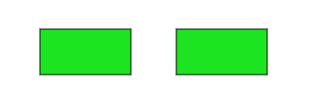
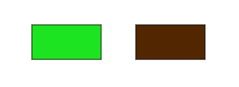
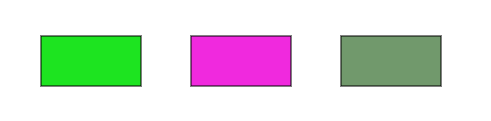

## Színezés

A hatékony rajzoláshoz ismernünk kell a színkezelés pontos mikéntjét. Hiszen a p5.js
erre is számos megoldást nyújt amelyek közötti különbségek nem feltétlenül egyértelműek.
Ebben a fejezetben átvesszük hogyan működik a színek megadása és megjelenítése a p5.js-ben.
A számos módszer közül is az **RGBA**-ra fogunk fókuszálni, mert az a leggyakoribb.

### Szín terek

A p5.js-ben három színtér közül tudunk választani. Mindegyikükben egy adott színt
megadása maximum négy paraméterrel fog történni. Viszont e négy paraméternek
pontos jelentése mindig csak magától a színtértől fog függeni.

#### colorMode()
A színtér kiválasztását a **colorMode()** függvénnyel tudjuk megtenni.
```JavaScript
colorMode(mode, max1, max2, max3, [maxA])
```
- *mode* - A színtér típusa. Lehet RGB, HSB és HSL.  
- *max1* - A piros szín vagy az árnyalat maximális értéke.
- *max2* - A zöld szín vagy a telitettség maximális értéke.
- *max3* - A kék szín vagy a fényesség, világosság maximális értéke.
- *maxA* - Az áttetszőség maximális értéke.

Ezeket az értékeket ritkán lesz szükséges átállítani. Olyankor pedig érdemes többet
tudni a másik két színtérről. Amik tárgyalása túlmutat ezen leírás keretein.

Három fő színtér áll rendelkezésünkre:
- **RGB**
- **HSB**
- **HSL**

Mind a három közül az **RGB** messze a leggyakrabban használt mód, így ez is az
alapértelmezett is a p5.js-ben. A másik kettő teljesen másféleképpen kezeli a színeket és a
hétköznapokban nem lesz rájuk különösebb szükségünk, így ezek felkutatását az
olvasóra bízzuk.

#### RGB

Az **RGB** színteret és az általa leírható színeket is gyakran szokás **RGB**-nek hívni.
Elemei:
- **R** - red, piros komponens, értéktartománya: 0 - 255
- **G** - green, zöld komponens, értéktartománya: 0 - 255
- **B** - blue, kék komponens, értéktartománya: 0 - 255

Ahol a *0* jelenti a szín teljes hiányát míg a *255* a maximális intenzitását.
Ezeknek az értékeknek a pontos beállításával kb 16 millió szín előállítására leszünk
képesek. Számos online felületen próbálhatunk ki különböző színeket. Két ilyen a
[Colorcodes](https://htmlcolorcodes.com/color-picker/) és a
[Htmlcolors](https://htmlcolors.com/html-color-picker).

Ez a triumvirátus esetenként ki szokott egészülni még egy **A** értékkel is amit *aplha*
értéknek hívunk. Ilyenkor egy **RGBA** színről beszélünk. Az **A** csupán annyit határoz meg,
hogy az adott szín mennyire áttetsző.
- **A** - alpha, áttetszőség, értéktartománya: 0 - 255

A 0-ás alpha érték a teljes áttetszőséget jelenti, ilyenkor lényegében nem látjuk tovább
az adott színt, csak ami esetleg mögötte van. A 255 pedig az alapértelmezett érték, ami
a meghatározott színt teljes egészében megtartja.

Egy összetett példa:
```JavaScript
function setup() {
  createCanvas(400, 400);
}

function draw() {
  stroke(166);
  line(50, 350, 350, 50);
  noStroke();
  background(253, 216, 53, 50);
  let rectangle_color = color(194, 24, 91);
  fill(rectangle_color);
  rect(50, 50, 100, 100);
  let circle_color = color(41, 182, 246, 128);
  fill(circle_color)
  circle(200, 200, 300);
  let triangle_color = color(18, 10, 143, 200);
  fill(triangle_color);
  triangle(250, 350, 300, 263, 350, 350);
}
```


### Színek megadása

Szineket lényegében 4 féleképpen tudunk megadni azokon a helyeken ahol az elvárt.
- 1 vagy 2 értékkel
- 3 vagy 4 értékkel
- szövegesen
- p5.Color objektummal

Mind közül a legrugalmasabb a p5.Color objektum lesz, de a többi opciónak is megvan
a maga helye. Főleg ha csak gyorsan meg szeretnénk nézni egy színt aminek a pontos
RGB értékét nem ismerjük, de mondjuk a szöveges megnevezését igen.

#### 1 vagy 2 értékkel

Ilyenkor a szürke 256 árnyalata között állítjuk be az értéket. Ahol *0* a fekete
, míg *255* a fehér lesz. Az opcionális másodlagos paraméter pedig ennek az árnyalatnak
az *alpha* értéke lesz.
```JavaScript
background(56);
```
```JavaScript
background(56, 125);
```

#### 3 vagy 4 értékkel

Ebben az esetben megadjuk a szín minden egyes elemét. Az alkalmazott színtértől függ
pontosan mit fog a három paraméter jelenteni. **RGB** esetén a piros, zöld és kék
komponenseket és az opcionális alpha értéket.
```JavaScript
background(153, 153, 0);
```
```JavaScript
background(253, 216, 53, 50);
```

Amennyiben **RGB** színtérrel dolgozunk és mind a piros, zöld és kék komponens intenzitását
ugyan azon az értéken tartjuk, úgy visszakapjuk a szürke árnyalatait. Ilyen esetekben
jóval kényelmesebb az ehhez tartozó specializációt használni, azaz csak 1 értéket megadni.
```JavaScript
background(56, 56, 56);
```
```JavaScript
background(56);
```

#### szövegesen

Ez a mód minden RGB, RGBA és Hexa CSS szín szöveges reprezentációját illetve minden nevesített
színt elfogad.
Például:
```JavaScript
background("lime")
```
```JavaScript
background("#00FF00")
```
ugyan azt az eredményt fogja adni.

#### p5.Color objektummal

A p5.js beépített szín osztálya amelyben bármely színt el tudunk tárolni.
Létrehozásához csupán a **color()** függvényt kell meghívnunk a fentebb leírt
módszerek egyikével.
```JavaScript
color(color)
```
- *color* - A fent felsorolt három módszer közül egy tetszőleges opció.

Egy p5.Color létrehozása:
```JavaScript
let ultramarine_blue = color(18, 10, 143);
```

### p5.Color objektum

A p5.Color objektum lényege a rugalmasságában nyilvánul meg. Egy tetszőleges
színt tudunk benne eltárolni a beállított színtértől függően. Ezt a színt utána bármilyen
színtérben ugyan úgy fogjuk tudni használni, mert ugyan azt fogja majd jelenteni.
Legegyszerűbben egy példán keresztül tudjuk szemléltetni ennek jelentőségét.
Először is nézzünk meg két négyzetet ugyan azzal a színnel kirajzolva:
```JavaScript
colorMode(RGB);
let rectangle_color = color(29, 228, 32);
fill(rectangle_color);
rect(50, 50, 100, 50);
colorMode(HSB);
fill(rectangle_color);
rect(200, 50, 100, 50);
```



Ahogy látjuk ugyan az maradt a szín függetlenül attól, hogy színteret váltottunk.
Viszont nézzük meg mi lesz ha nem egy p5.Color objektummal adjuk át a színt hanem
csak a 3 paraméterével.

```JavaScript
colorMode(RGB);
fill(29, 228, 32);
rect(50, 50, 100, 50);
colorMode(HSB);
fill(29, 228, 32);
rect(200, 50, 100, 50);
```



Ezen felül még számos függvényt érünk el. Amelyek mindegyike a minél kényelmesebb
használatot hivatott elősegíteni. Segítségükkel meg azt is nézni mik lennének
az adott szín pontos értékei egy másik színtérben.
- **red()** - Visszaadja a piros komponens intenzitását az adott színtérben.
- **green()** - Visszaadja a zöld komponens intenzitását az adott színtérben.
- **blue()** - Visszaadja a kék komponens intenzitását az adott színtérben.
- **alpha()** - Visszaadja az alpha komponens intenzitását az adott színtérben.
- **hue()** - Visszaadja az árnyalat komponens intenzitását az adott színtérben.
- **saturation()** - Visszaadja az telitettség komponens intenzitását az adott színtérben.
- **brightness()** - Visszaadja a fényesség komponens intenzitását az adott színtérben.
- **lightness()** - Visszaadja az világosság komponens intenzitását az adott színtérben.
- **lerpColor()** - Összemossa a színeket.

Nézzük meg mit is jelent az aktuális színtér egy példán keresztül:
```JavaScript
colorMode(RGB, 255);
let rectangle_color = color(29, 228, 32);
print("Red: " + red(rectangle_color));
print("Green: " + green(rectangle_color));
print("Blue: " + blue(rectangle_color));
print("Alpha: " + alpha(rectangle_color));
colorMode(RGB, 1);
print("Scaled Red: " + red(rectangle_color));
print("Scaled Green: " + green(rectangle_color));
print("Scaled Blue: " + blue(rectangle_color));
print("Scaled Alpha: " + alpha(rectangle_color));
```
Először is az alapértelmezett **RGB** színteret állítjuk meg ahol minden komponens
0 és 255 közti értéket vehet fel. Létrehozunk egy p5.Color objektumot és kiíratjuk
a komponenseit. Ahogy látszik pontosan ugyan azokat az értékeket kaptuk vissza amiket
beállítottunk.
Ezután egy olyan térbe váltunk ahol még mindig **RGB** színeket használunk, de
már csak 0 - 1 közötti értéket vehetnek fel az egyes komponensek. Majd kiírjuk
az előzőleg létrehozott szín komponenseit. Ahogy látszik a szín nem változott
csak az hogy az adott környezetben éppen mik volnának a komponensei pontos értékei.
```
Red: 29
Green: 228
Blue: 32
Alpha: 255
Scaled Red: 0.11372549019607843
Scaled Green: 0.8941176470588236
Scaled Blue: 0.12549019607843137
Scaled Alpha: 1
```

Amennyiben egy olyan színtérbéli értéket szeretnénk elérni ami éppen nem része az aktuális
színtérnek, azt úgy fogjuk megkapni mintha annak a színtérnek az alapértelmezett
beállításait használnánk.
```JavaScript
colorMode(RGB, 255);
let rectangle_color = color(29, 228, 32);
print("Hue: " + hue(rectangle_color));
print("Saturation: " + saturation(rectangle_color));
print("Brightness: " + brightness(rectangle_color));
print("Lightness: " + lightness(rectangle_color));
colorMode(HSB);
print("Hue: " + hue(rectangle_color));
print("Saturation: " + saturation(rectangle_color));
print("Brightness: " + brightness(rectangle_color));
print("Lightness: " + lightness(rectangle_color));
```
```
Hue: 120.90452261306534
Saturation: 78.65612648221344
Brightness: 89.41176470588236
Lightness: 50.3921568627451
Hue: 120.90452261306534
Saturation: 78.65612648221344
Brightness: 89.41176470588236
Lightness: 50.3921568627451
```

#### lerpColor()

```JavaScript
lerpColor(c1, c2, amt)
```
- *c1* - A színskála egyik végpontja.
- *c2* - A színskála másik végpontja.
- *amt* - A színskáláról honnét szeretnénk a színt kapni. 0 - 1 közötti értéket vehet fel.
0-ra visszakapjuk *c1*-et, 1-re pedig *c2*-t. Közte pedig a két szín arányos keverékét.

A két színből interpolálunk egy harmadikat. Ahol az *amt* meghatározza melyik színhez álljon
közelebb az eredmény.

```JavaScript
colorMode(RGB, 255);
let c1 = color(29, 228, 32);
let c2 = color(240, 41, 222);
fill(lerpColor(c1, c2, 0));
rect(50, 50, 100, 50);
fill(lerpColor(c1, c2, 1));
rect(200, 50, 100, 50);
fill(lerpColor(c1, c2, 0.4));
rect(350, 50, 100, 50);
```



[2D rajzolás](6_2d_drawing.md)
